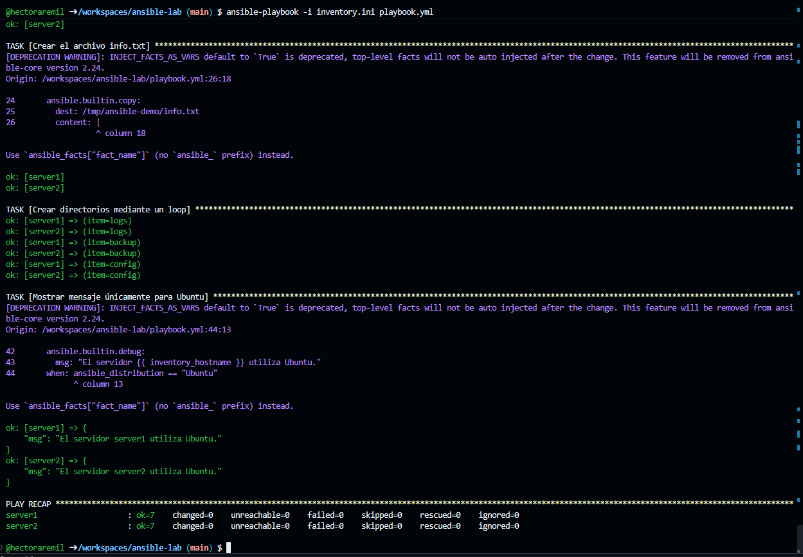

# Laboratorio de Docker y Ansible

## Objetivo de la práctica

El objetivo de esta práctica es crear un laboratorio compuesto por dos servidores Linux utilizando contenedores Docker y administrarlos de manera automatizada mediante Ansible.

Los servidores utilizan la imagen Ubuntu 24.04 y son administrados desde un nodo de control ejecutado en GitHub Codespaces. Ansible se conecta directamente a los contenedores mediante la conexión de Docker, sin necesidad de configurar un servidor SSH.

El playbook desarrollado realiza las siguientes acciones en ambos servidores:

* Muestra el nombre del servidor.
* Muestra el sistema operativo y su versión.
* Crea el directorio `/tmp/ansible-demo`.
* Crea el archivo `info.txt`.
* Escribe en el archivo el nombre del servidor y el sistema operativo.
* Crea los directorios `logs`, `backup` y `config` mediante un loop.
* Muestra un mensaje condicionado cuando el sistema operativo es Ubuntu.

## Estructura del proyecto

```text
ansible-lab/
├── docker-compose.yml
├── inventory.ini
├── playbook.yml
├── README.md
└── captura-playbook.png
```

## Iniciar los contenedores

Para crear e iniciar los dos servidores se utiliza:

```bash
docker compose up -d
```

Para comprobar que los contenedores están en ejecución:

```bash
docker ps
```

## Instalar Python en los servidores

Python es necesario para que Ansible pueda ejecutar sus módulos dentro de los contenedores.

```bash
docker exec server1 bash -c "apt update && apt install -y python3"
docker exec server2 bash -c "apt update && apt install -y python3"
```

## Comprobar la conexión de Ansible

```bash
ansible docker -i inventory.ini -m ping
```

Los dos servidores deben responder con el mensaje `pong`.

## Validar el playbook

```bash
ansible-playbook -i inventory.ini playbook.yml --syntax-check
```

## Ejecutar el playbook

```bash
ansible-playbook -i inventory.ini playbook.yml
```

## Verificar los resultados

Para comprobar los archivos y directorios creados en el primer servidor:

```bash
docker exec server1 ls -la /tmp/ansible-demo
docker exec server1 cat /tmp/ansible-demo/info.txt
```

Para comprobar los archivos y directorios creados en el segundo servidor:

```bash
docker exec server2 ls -la /tmp/ansible-demo
docker exec server2 cat /tmp/ansible-demo/info.txt
```

## Detener el laboratorio

Para detener y eliminar los contenedores:

```bash
docker compose down
```

## Evidencia de ejecución

La siguiente captura muestra la ejecución exitosa del playbook sobre los servidores `server1` y `server2`.


